## 1 设计模式介绍

### 1.1 设计模式简介

设计模式是一套被反复使用的，多人知晓的，经过分类编目的代码设计经验的总结。

### 1.2 设计模式的类型

- 创建者模式（例：工厂模式、单例模式等）

  ：提供了一种在创建对象的同时隐藏创建逻辑的方式，不是直接使用new来创建对象。

- 结构性模式（例：适配器模式、装饰者模式、代理模式等）

  ：关注类和对象的组合。

- 行为型模式（例：策略模式、解释器模式、观察者模式）

  ：关注对象之间的通信。

- J2EE模式（例：MVC模式、前端控制器模式等）

  ：关注表示层。

### 1.3 设计模式6大原则

1. 开闭原则

   ：对扩展开放，对修改关闭。拓展程序而不修改原有代码。

2. 里氏代换原则

   ：任何父类可以出现的地方，子类一定可以出现。只有当子类可以替换掉父类，且软件单位功能不受影响时，父类才能真正被复用，而子类也能够在父类的基础上增加新的行为。

3. 依赖倒转原则

   ：针对接口编程，依赖于抽象而不依赖与具体。

4. 接口隔离原则

   ：使用多个隔离的接口，比使用单个接口要好。降低类之间的耦合度。

5. 最少知道原则（迪米特原则）

   一个实体应该尽量少地与其他实体发生相互作用，使得系统功能模块相对独立。

6. 合成复用原则

   尽量使用合成（聚合）的方法，而不是继承。

## 2 工厂模式（Factory Pattern）

### 2.1 实现图

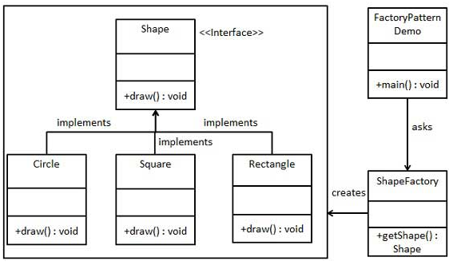

### 2.2 实现步骤

1. 创建一个接口
2. 创建接口实现类
3. 创建一个工厂，生成基于给定信息的实体类的对象
4. 使用工厂，获取相应的实体对象

## 3 抽象工厂模式（Abstract Factory Pattern）

### 3.1 实现图

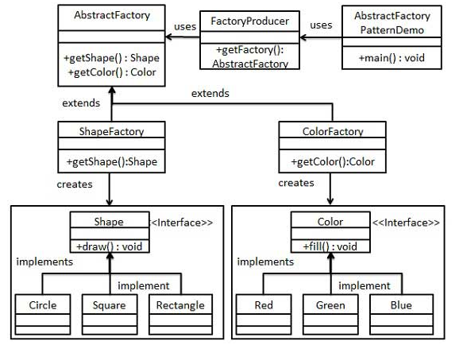

### 3.2 实现步骤

1. 为形状和颜色分别创建接口
2. 创建接口的实现类
3. 为形状和颜色创建抽象工厂类 AbstractFactory
4. 创建工厂类继承抽象工厂类 ShapeFactory extends AbstractFactory
5. 创建工厂创造器类，通过相关信息生成指定工厂

## 4 单例模式（Singleton Pattern）

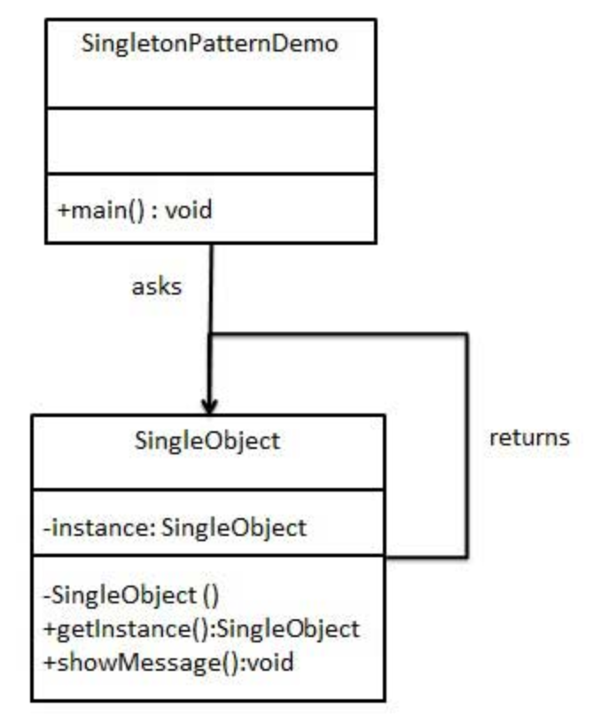

#### 步骤：

1. 创建一个类

   ```java
   public class SingleObject {
   	// 创建一个对象
   	private static SingleObject instance=new SingleObject();
   	// 私有构造函数，不会被实例化
   	private SingleObject() {
   	}
   	// 获取唯一可用的对象
   	public static SingleObject getInstance() {
   		return instance;
   	}
   	public void showMessage() {
   		System.out.println("hello world.");
   	}
   }
   ```

2. 从类中获取对象

   ```java
   public class SingletonPatternDemo {
   	public static void main(String[] args) {
   		// 获取唯一可用对象
   		SingleObject instance = SingleObject.getInstance();
   		instance.showMessage();
   	}
   }
   ```


## 5 建造者模式（Builder Pattern）

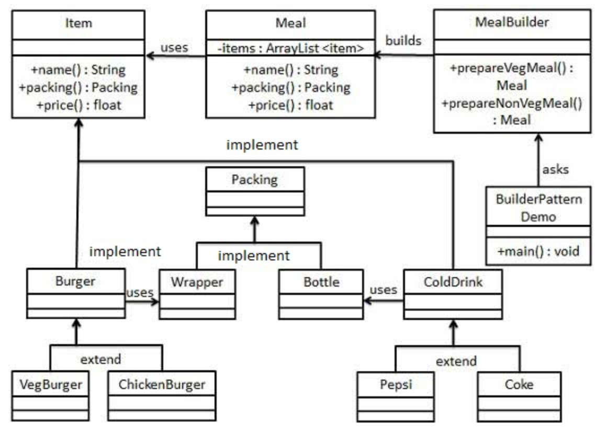

#### 步骤：

1. 分别创建表示食物条目和食物包装的接口 Item; Packing
2. 创建接口实现类 Burger, ColdDrink; Wrapper, Bottle
3. 创建继承的实体类 VegBurger, ChickenBurger; Pepsi, Coke
4. 创建一个Meal类
5. 创建一个MealBuilder类，负责创建Meal对象

## 6 适配器模式（Adapter Pattern）

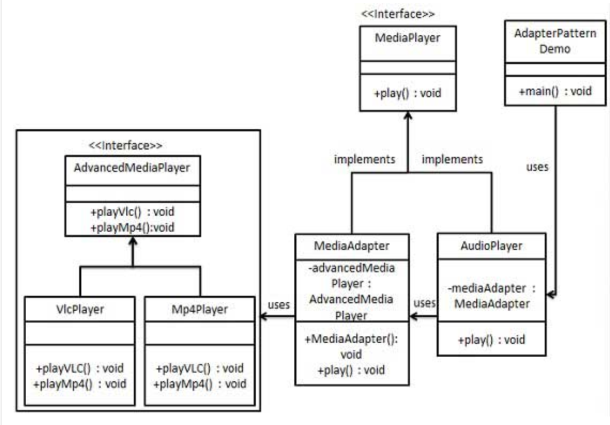

#### 步骤：

1. 创建接口 MediaPlayer; AdvancedMediaPlayer
2. 创建接口实现类 VlcPlayer, Mp4Player
3. 创建适配器 MediaAdapter
4. 创建实现类 AudioPlayer

## 7 装饰器模式（Decorator Pattern）

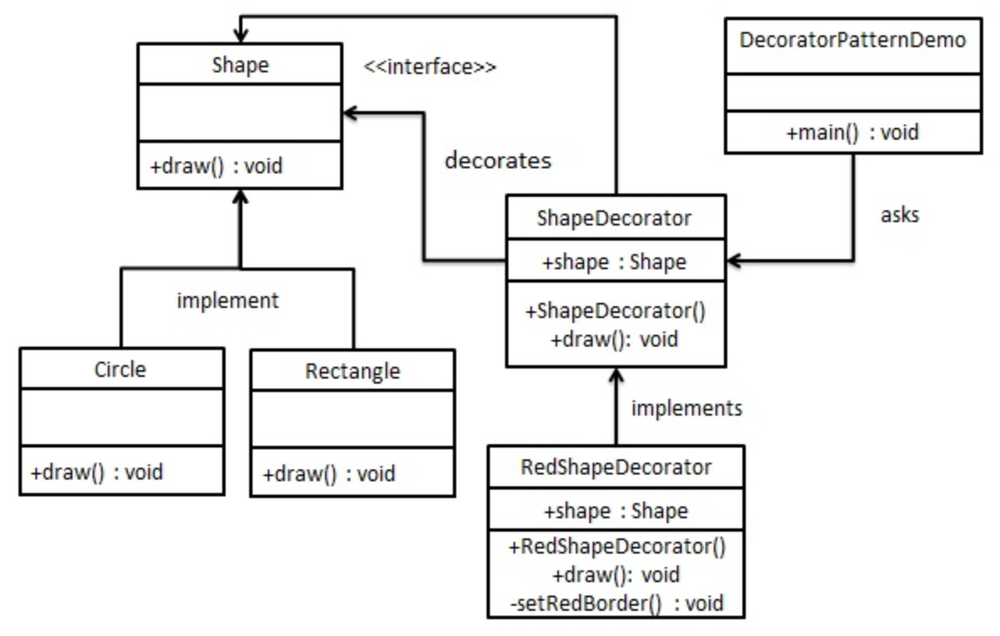

#### 步骤：

1. 创建一个接口 Shape
2. 创建接口实现类 Rectangle; Circle
3. 创建实现Shape接口的抽象装饰类 ShapeDecorator
4. 创建继承ShapeDecorator的类 RedShapeDecorator，提供装饰方法
5. 使用RedShapeDecorator来装饰Shape对象

## 8 策略模式（Strategy Pattern）

在策略模式中，一个类的行为或其算法可以在运行时更改。

**意图：**定义一系列的算法，把它们一个个封装起来，并且使它们可以相互替换。

**主要解决：**在有多种算法相似的情况下，使用if…else所带来的复杂和难以维护。

**使用场景：**1、如果在一个系统里面有许多类，它们之间的区别仅在于它们的行为，那么使用策略模式可以动态地让一个对象在许多行为中选择一种行为。 2、一个系统需要动态地在几种算法中选择一种。

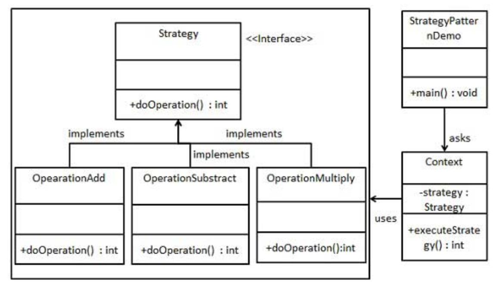

#### 步骤：

1. 创建一个接口 Strategy
2. 创建实现类 OperationAdd ...
3. 创建Context类，来执行算法

## 9 观察者模式（Observer Pattern）

当对象间存在一对多的关系时使用。

**意图：**定义对象间的一种一对多的依赖关系，当一个对象的状态发生改变时，所有依赖于它的对象都得到通知并被自动更新。

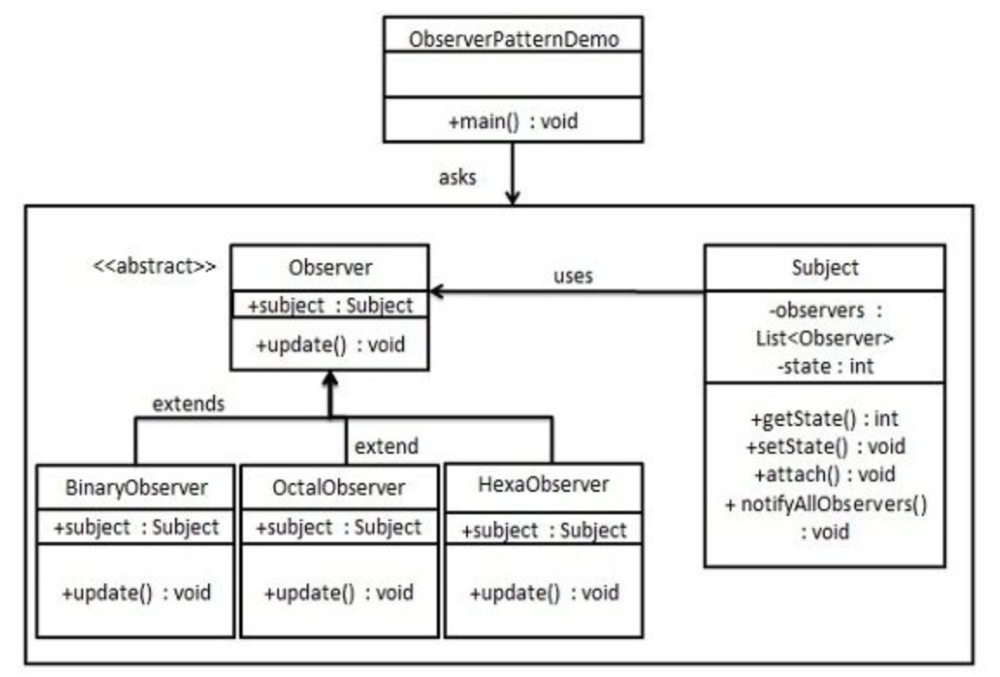

#### 步骤：

1. 创建Subject类，包含通知所有观察者的方法
2. 创建Observer抽象类
3. 创建实体观察者类BinaryObserver ....

## 10 代理模式（Proxy Pattern）

意图：为其他对象提供一种代理已控制这个对象的访问。

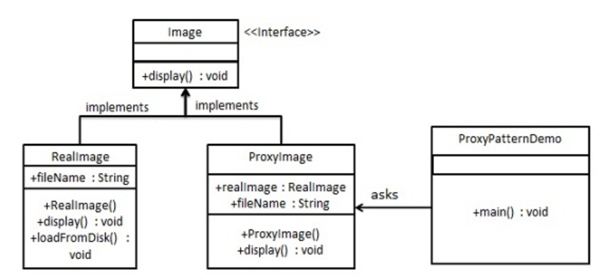

#### 步骤：

1. 创建接口 Image
2. 创建实现类 RealImage; ProxyImage

## 11 命令模式（Command Pattern）

意图：将一个请求封装成一个对象，从而使您可以用不同的请求对客户进行参数化。

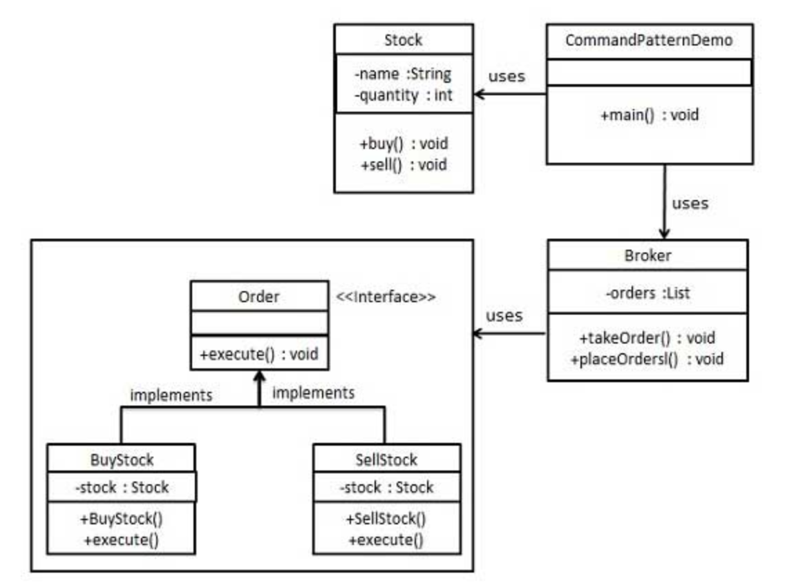

#### 步骤：

1. 创建一个命令接口 Order
2. 创建一个请求类 Stock
3. 创建接口实现类 BuyStock; SellStock
4. 创建命令调用类 Broker

## 12 组合模式（Composite Pattern）

意图：将对象组合成树形结构来表示“部分-整体”的层次结构。

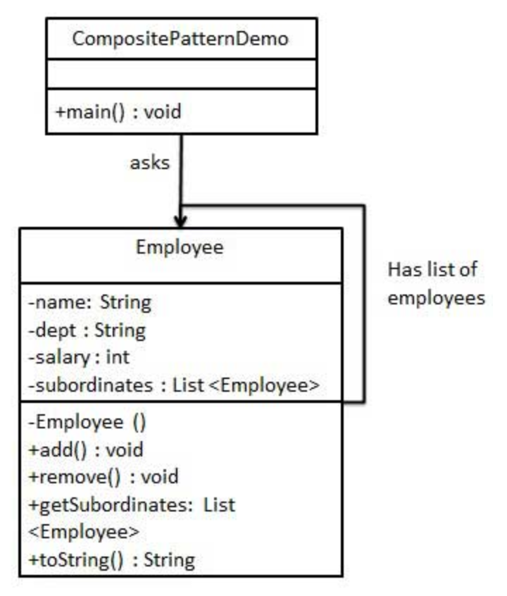

#### 步骤：

1. 创建类 Employee，带有对象的列表